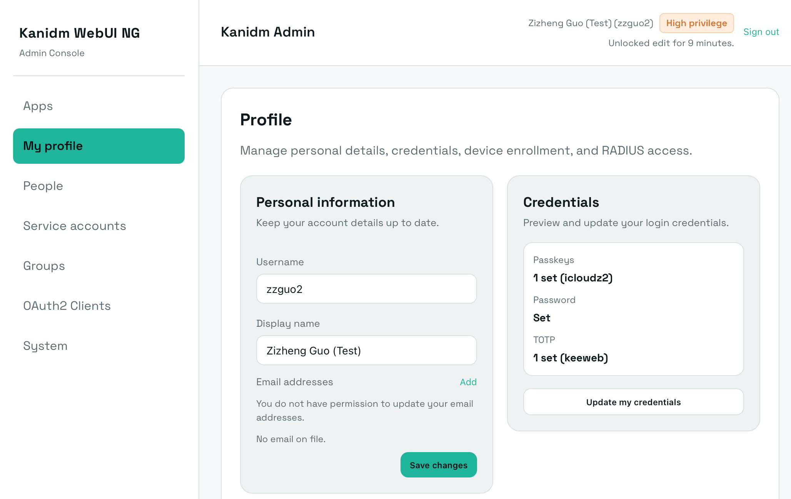
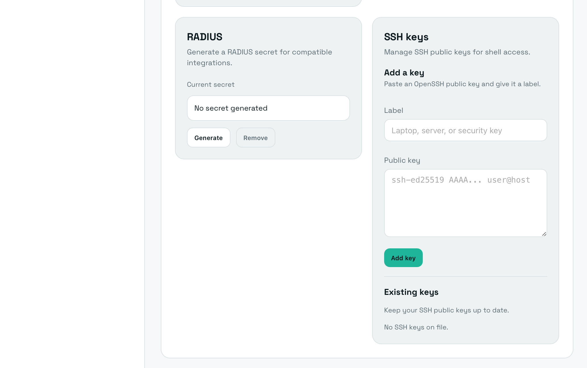
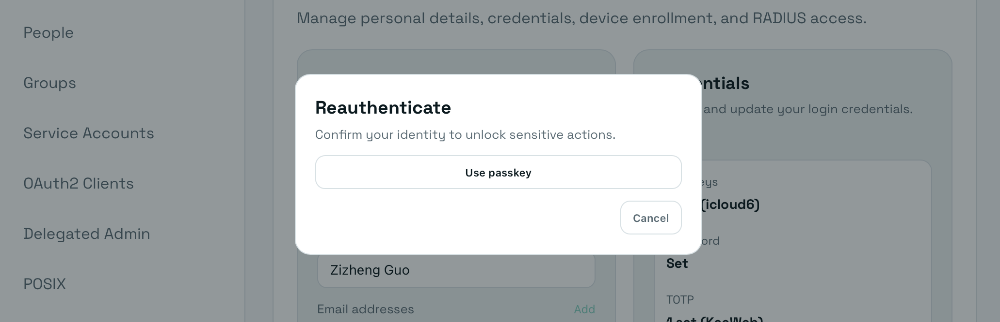
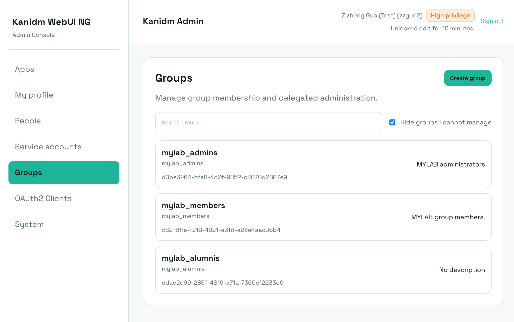
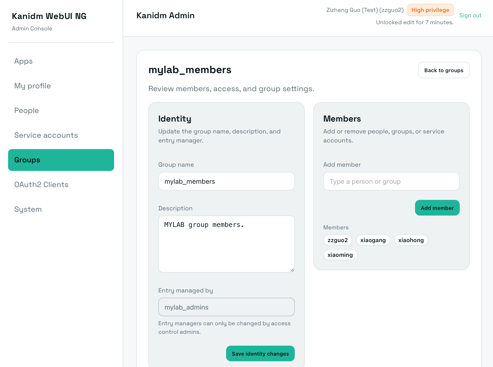
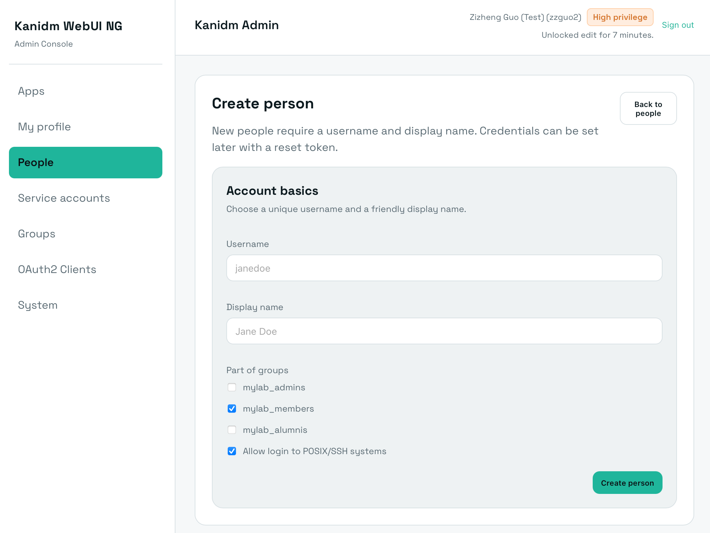
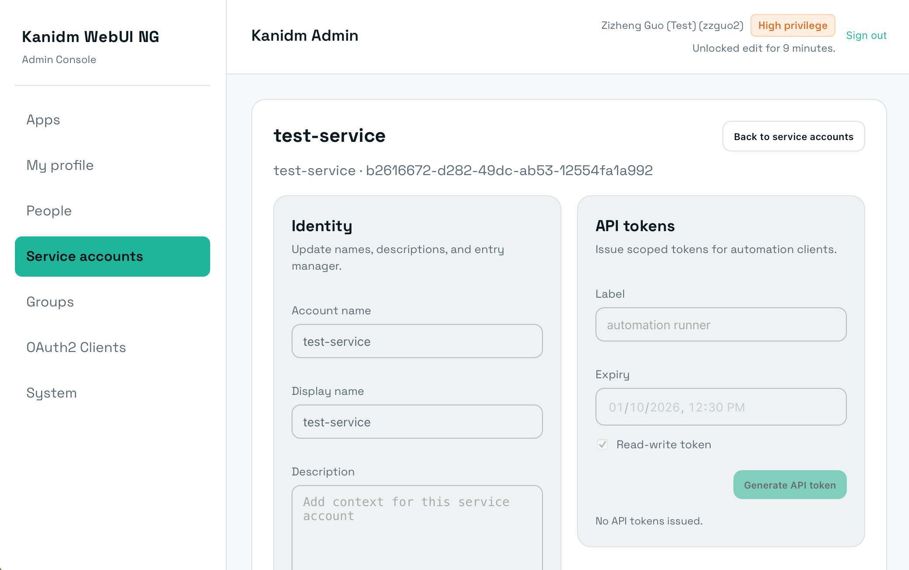

# Modern Web UI for Kanidm

This project aims to implement a fully-featured web UI for the [kanidm](https://github.com/kanidm/kanidm) identity management platform.

## Roadmap

- [x] User login flow (password, password+TOTP, passkey)
- [x] Dark/light theming and English/中文 i18n
- [x] Profile edits, password resets, RADIUS
- [x] SSH key self service
- [x] People management (create, modify, get reset token, POSIX management)
- [x] Group management
- [x] Service accounts management
- [x] Friendly user on boarding
- [ ] OAuth2 clients
- [ ] System (domain, db, etc.) management and customization

## Code Guide

While AI-generated code is not accepted for the security-critical kanidm server, this Web UI is just a thin client like the CLI client so it is unlikely to have security issues on its own. We extensively use AI to generate the frontend code, which AI is pretty good at.

We aim to build the Web UI with minimum to no change to the server and its REST APIs to ensure its security.

### Start Developing

`npm install` , then `npm run dev` . Visit your site at `http://localhost:5173`.

The development server includes a reverse proxy to `https://localhost:8443` for the API endpoints. You should have the development server up by running `<path to kanidm>/server/daemon/run_insecure_dev_server.sh` as instructed in [kanidm book](https://kanidm.github.io/kanidm/master/developers/index.html#development-server-for-interactive-testing). 

To make the WebAuthn working, you should edit `server/daemon/insecure_server.toml` and set `origin = "http://localhost:5173"`.
