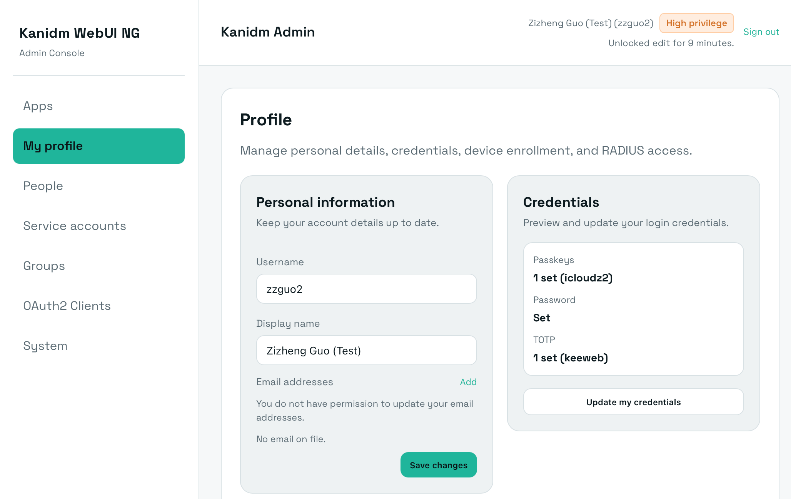
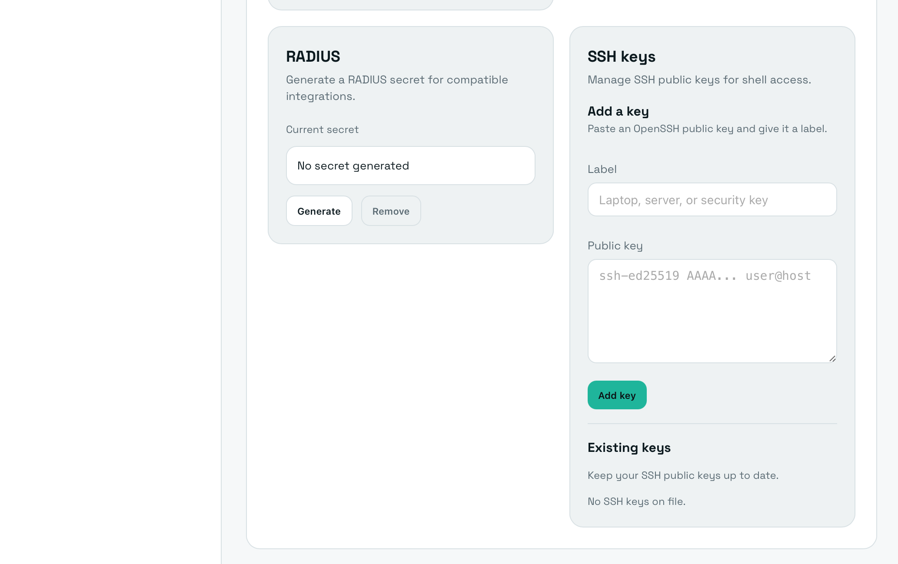
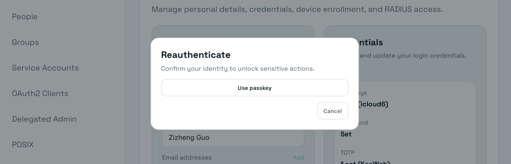
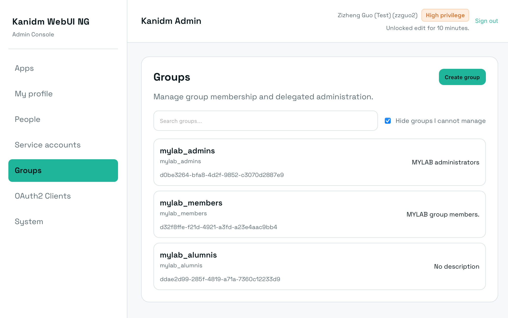
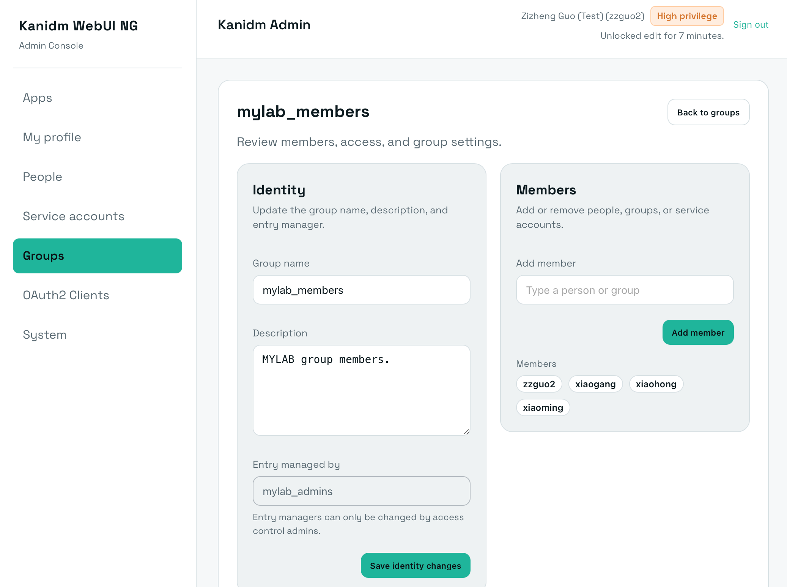
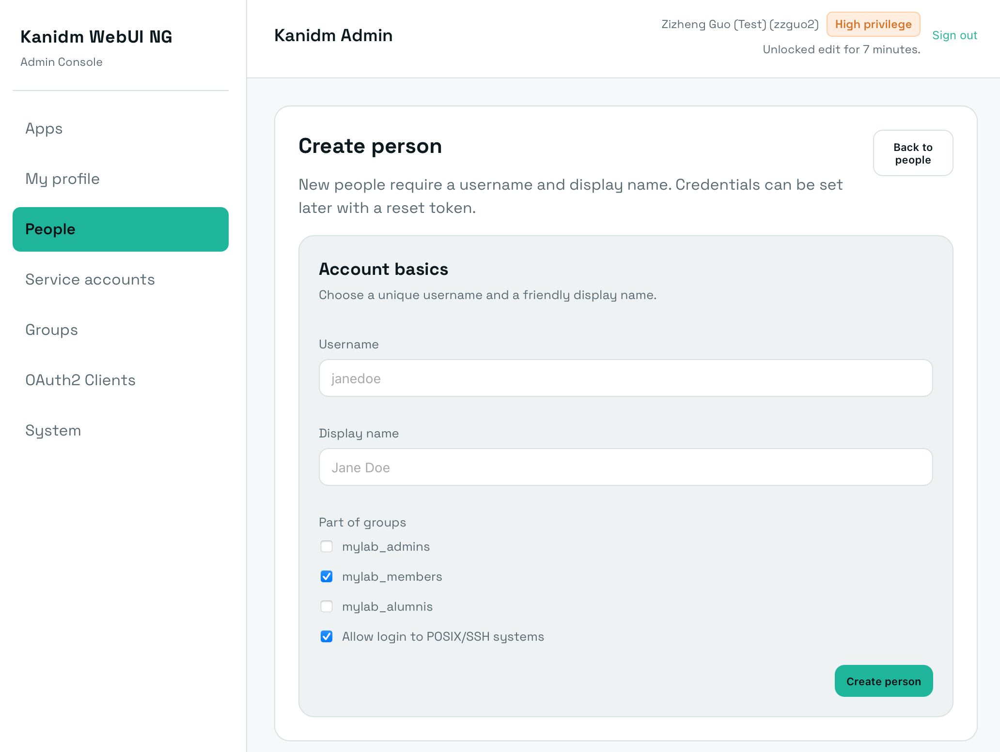
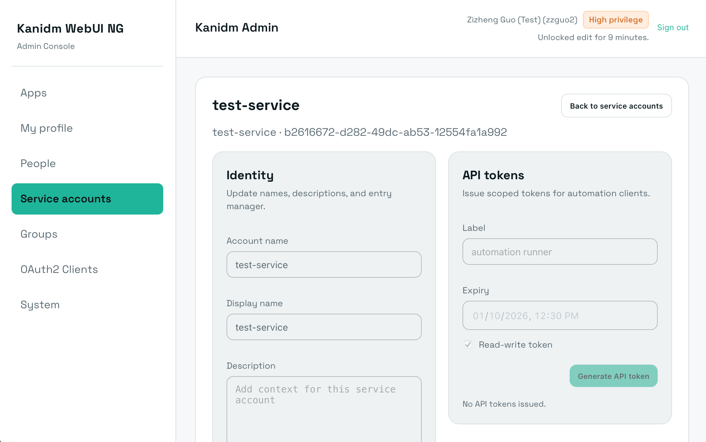

# Modern Web UI for Kanidm

This project implements a fully-featured web UI for the [kanidm](https://github.com/kanidm/kanidm) identity management platform.

















## Roadmap

- [x] User login flow (password, password+TOTP, passkey)
- [x] Dark/light theming and English/中文 i18n
- [x] Profile edits, password resets, RADIUS
- [x] SSH key self service
- [x] People management (create, modify, get reset token, POSIX management)
- [x] Group management
- [x] Service accounts management
- [x] Friendly user on boarding
- [x] OAuth2 clients
- [x] System (domain, db, etc.) management and customization


## Code Guide

While AI-generated code is not accepted for the security-critical kanidm server, this Web UI is just a thin client like the CLI client so it is unlikely to have security issues on its own. We extensively use AI to generate the frontend code, which AI is pretty good at.

We aim to build the Web UI with minimum to no change to the server and its REST APIs to ensure its security.


### Development

`npm install` , then `npm run dev` . Visit your site at `http://localhost:5173`.

The development server includes a reverse proxy to `https://localhost:8443` for the API endpoints. You should have the development server up by running `<path to kanidm>/server/daemon/run_insecure_dev_server.sh` as instructed in [kanidm book](https://kanidm.github.io/kanidm/master/developers/index.html#development-server-for-interactive-testing). 

To make the WebAuthn working, you should edit `server/daemon/insecure_server.toml` and set `origin = "http://localhost:5173"`.


### Production Deployment

Run `npm run build` to compile the frontend, and then setup a reverse proxy to serve both the frontend and the backend. Example configuration for nginx:

``` nginx
server {
    listen 443 ssl http2;
    server_name idm.example.com;

    # TLS certs
    ssl_certificate     /etc/letsencrypt/live/idm.example.com/fullchain.pem;
    ssl_certificate_key /etc/letsencrypt/live/idm.example.com/privkey.pem;

    # Built frontend (vite build output)
    root /var/www/kanidm-webui-ng/dist;
    index index.html;

    # --- Kanidm backend ---
    # Adjust if your kanidmd is elsewhere.
    set $kanidm_upstream https://127.0.0.1:8443;
    # If backend uses self-signed cert in dev:
    proxy_ssl_trusted_certificate /path/to/self-signed-chain.pem;

    # Preserve host/proto/client info
    proxy_set_header Host $host;
    proxy_set_header X-Forwarded-Proto $scheme;
    proxy_set_header X-Forwarded-For $proxy_add_x_forwarded_for;
    proxy_set_header X-Real-IP $remote_addr;

    # API and oauth endpoints proxied to kanidmd
    location /v1/ { proxy_pass $kanidm_upstream; }
    location /scim/ { proxy_pass $kanidm_upstream; }
    # Rewrite OpenID discovery URL for oauth2 apps
    location ~ ^/oauth2/openid/[^/]+/\.well-known/openid-configuration$ {
        proxy_pass $kanidm_upstream;
        # Disable compression for sub_filter to work
        proxy_set_header Accept-Encoding "";
        sub_filter_once off;
        sub_filter_types application/json;
        # Adjust old endpoint -> new UI endpoint
        sub_filter '/ui/oauth2' '/oauth2-ui/authorise';
    }
    location /oauth2/ { proxy_pass $kanidm_upstream; }
    location /ui/ { proxy_pass $kanidm_upstream; }
    location = /manifest.webmanifest { proxy_pass $kanidm_upstream; }

    # SPA routes
    location / {
        try_files $uri $uri/ /index.html;
    }

    # Optional: cache static hashed assets aggressively
    location /assets/ {
        expires 1y;
        add_header Cache-Control "public, immutable";
        try_files $uri =404;
    }
}
```

